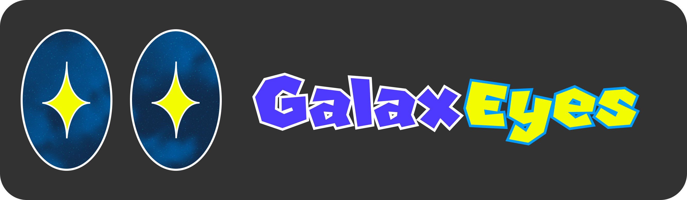

**GalaxEyes** is a tool for Super Mario Galaxy 2 that optimizes and checks for issues in your mod. 

It features:
- Removing vanilla files from your mod
- Merging identical collision codes
- Resampling and re-encoding your ASTs to be more efficient
- ...and more!

# Libraries

[JATAst by Xayrga](https://github.com/XAYRGA/jatast).

Powered by the [Hack.io Libraries](https://github.com/SuperHackio/Hack.io) by Super Hackio. Used with permission. The Hack.IO.KCL included in this repository is based on Bavario's fork of Hack.io.

[jkr_lib/jkr_tool and binary_stream by Lord Giganticus](https://github.com/Lord-G-INC/jkr_tool). 

[Avalonia by AvaloniaUI](https://github.com/AvaloniaUI/Avalonia).

[CommunityToolkit.Mvvm](https://www.nuget.org/packages/CommunityToolkit.Mvvm/) and [System.Text.Json](https://www.nuget.org/packages/System.Text.Json) by Microsoft.

See [THIRD_PARTY_LICENSES](/THIRD_PARTY_LICENSES) for their specific licenses.

# Building

All you will need is .NET SDK 8.

First, download this source code and all its submodules:

`git clone --recurse-submodules https://github.com/AwesomeTMC/GalaxEyes.git`

Then, in the folder downloaded, run:

`dotnet publish GalaxEyes/GalaxEyes.csproj -c Release -p:PublishProfile=Windows-x64`

Replace `Windows-x64` with `Linux-x64` or `osx-x64`, depending on your operating system.

The resulting executable should be in `/GalaxEyes/bin/Release/net8.0/win-x64/publish/` (replace `win-x64` with `linux-x64` or `osx-x64`)

If you wish to contribute, just open the included `GalaxEyes.slnx` with Visual Studio and click the play button at the top (it should say "GalaxEyes").